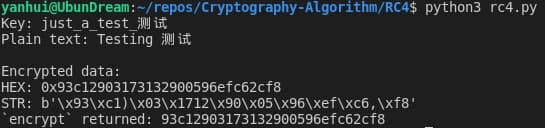
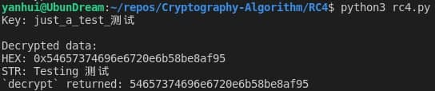
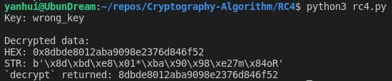

# RC4

## 密钥流生成

- 对应函数 [`KSA`](https://github.com/YanhuiJessica/Cryptography-Algorithm/blob/main/RC4/rc4.py#L1) 和 [`PRGA`](https://github.com/YanhuiJessica/Cryptography-Algorithm/blob/main/RC4/rc4.py#L16)
- 获取密钥流：`PRGA(KSA(key))`

### KSA

||输入 | 输出
-|-|-
数值含义|密钥|S 数组
数值类型|字节|整型数组

- 依据密钥生成初始 S 数组

### PRGA

||输入 | 输出
-|-|-
数值含义|S 数组|S[t]
数值类型|整型数组|整型

- 调用 `PRGA` 函数获取密钥流生成器
- 当且仅当调用 `__next__()` 时执行一次循环体

## 加密过程（[`encrypt`](https://github.com/YanhuiJessica/Cryptography-Algorithm/blob/main/RC4/rc4.py#L30)）

<table>
<thead>
  <tr>
    <th></th>
    <th colspan="3">输入</th>
    <th>输出</th>
  </tr>
</thead>
<tbody>
  <tr>
    <td>数值含义</td>
    <td>密钥</td>
    <td>明文</td>
    <td>明文是否为十六进制字符串</td>
    <td>密文</td>
  </tr>
  <tr>
    <td>数值类型</td>
    <td>字符串</td>
    <td>字符串</td>
    <td>布尔值（默认为 False）</td>
    <td>十六进制字符串</td>
  </tr>
</tbody>
</table>

- 分别将密钥和明文转化成字节进行加密操作，有利于处理含有汉字的字符串
- 明文每字节与密钥流异或得密文，调用 `print_result` 函数打印输出加密结果

### 示例

- 调用函数及顺序
  ```py
  if __name__ == '__main__':
    key = input('Key: ')
    plain = input('Plain text: ')

    cipher = encrypt(key, plain)
    print('`encrypt` returned:', cipher)
  ```
- 密钥、明文及加密结果<br>


## 解密过程（[`decrypt`](https://github.com/YanhuiJessica/Cryptography-Algorithm/blob/main/RC4/rc4.py#L58)）

<table>
<thead>
  <tr>
    <th></th>
    <th colspan="3">输入</th>
    <th>输出</th>
  </tr>
</thead>
<tbody>
  <tr>
    <td>数值含义</td>
    <td>密钥</td>
    <td>密文</td>
    <td>密文是否为十六进制字符串</td>
    <td>明文</td>
  </tr>
  <tr>
    <td>数值类型</td>
    <td>字符串</td>
    <td>字符串</td>
    <td>布尔值（默认为 False）</td>
    <td>十六进制字符串</td>
  </tr>
</tbody>
</table>

- 支持输入十六进制字符串形式的密文，适用于含有不可打印字符的密文
- 密文每字节与密钥流异或得明文，调用 `print_result` 函数打印输出加密结果

### 示例

- 调用函数及顺序
  ```py
  if __name__ == '__main__':
    key = input('Key: ')
    cipher = '93c12903173132900596efc62cf8'

    plain = decrypt(key, cipher, True)
    print('`decrypt` returned:', plain)
  ```
- 密钥正确则可以解密获得期望的明文<br>

- 密钥错误则无法解密获得期望的明文<br>


## 参考资料

- [RC4 - Wikipedia](https://en.wikipedia.org/wiki/RC4)